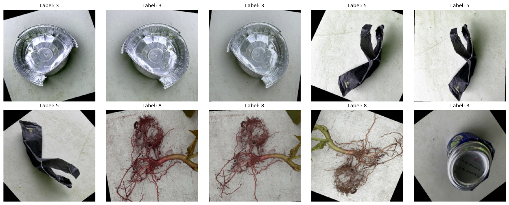
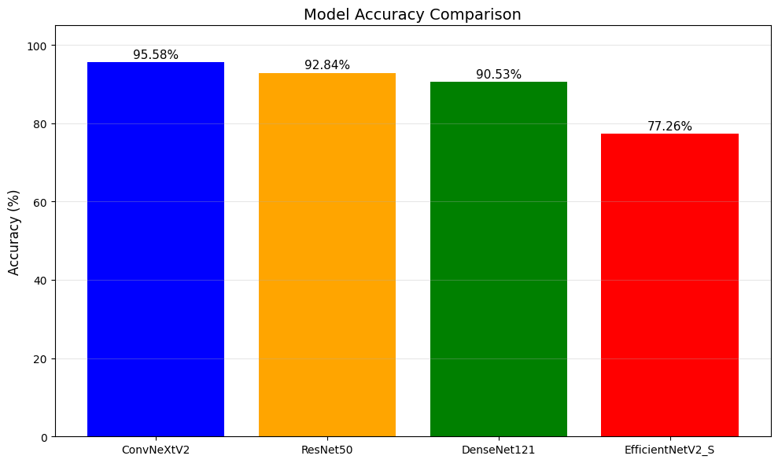
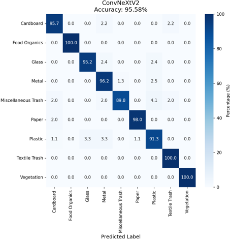

# RealWaste Classification

**Authors:** Junghoon Park, Sihoon Park  
**Project:** Automated waste classification using CNNs  
**Dataset:** RealWaste dataset (9 classes, 4,752 images)

---

## Project Overview

This project aims to improve recycling efficiency by automatically classifying waste images into nine categories:  

- Cardboard  
- Food Organics  
- Glass  
- Metal  
- Miscellaneous Trash  
- Paper  
- Plastic  
- Textile Trash  
- Vegetation  

We leverage **pre-trained Convolutional Neural Networks (CNNs)** and **transfer learning** to maximize classification accuracy.

## Dataset
This project uses the **RealWaste dataset**, a real world waste classification dataset collected within an authentic landfill environment.

- Source: https://archive.ics.uci.edu/dataset/908/realwaste
- 4,752 real-world waste images
- 9 classes:
  - Cardboard, Food Organics, Glass, Metal, Miscellaneous Trash, Paper, Plastic, Textile Trash, Vegetation
- Imbalanced distribution handled via **weighted CrossEntropyLoss** and **stratified sampling**
- Images preprocessed to 224×224 and normalized using ImageNet normalization.

### Data Augmentation
To improve generalization:
- Random horizontal/vertical flips
- Random rotations
- RandomResizedCrop (scale 0.75–1.0)
- ColorJitter (brightness/contrast/saturation/hue)

## Models and Approach

We implemented and fine-tuned four pre-trained models:

| Model | Approach |
|-------|---------|
| ResNet50 | Partial fine-tuning of last block + classifier |
| DenseNet121 | Partial fine-tuning of last block + classifier |
| ConvNeXtV2 | Partial fine-tuning of last block + classifier |
| EfficientNetV2-S | Partial fine-tuning of last block + classifier |

Key techniques:

- Transfer learning with pre-trained ImageNet weights  
- Partial fine-tuning (last conv block + classifier)  
- Data augmentation (RandomResizedCrop, ColorJitter, flips, rotations)  
- Weighted CrossEntropyLoss for class imbalance  
- Optimizer: AdamW with ReduceLROnPlateau scheduler  

---

## Results

| Model | Accuracy | F1 Score |
|-------|---------|----------|
| ConvNeXtV2 | 95.58% | 95.57% |
| ResNet50 | 92.84% | 92.86% |
| DenseNet121 | 90.53% | 90.49% |
| EfficientNetV2-S | 77.26% | 76.69% |

> ConvNeXtV2 achieved the best performance, surpassing the baseline and previous studies.

### Confusion Matrix of ConvNeXtV2

## Usage

This project supports image-based waste classification using trained CNN models.

Example:
- Input: an iamge of waste 
- Output: predicted category (e.g., Plastic, Metal, Paper)
## Error Analysis

- Miscellaneous Trash and Plastic classes are most frequently misclassified due to visual ambiguity.  
- Metal is sometimes confused with Plastic, likely because of reflective surfaces.  
- Future improvements: more diverse image collection under varied lighting conditions.

## How to Run

1. Download the dataset from:
https://archive.ics.uci.edu/dataset/908/realwaste

2. Place the dataset in the following directory structure (relative to the notebook):
Dataset/realwaste/
   
3. Open and run the Jupyter notebook

## Additional Details

For detailed methodology, experiments, and analysis, refer to the full report:

📄 [Final Report](docs/Final_Project.pdf)
